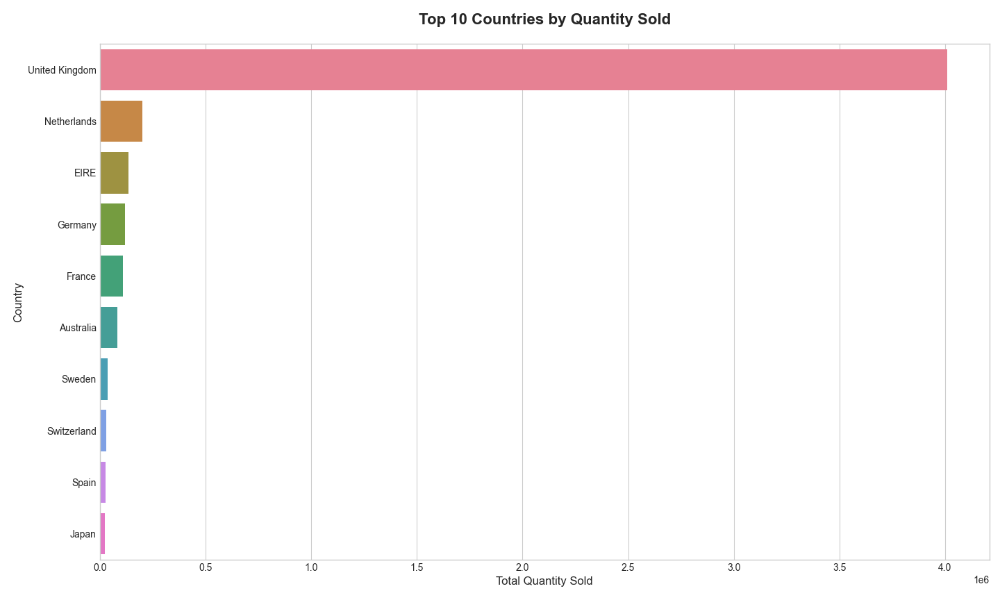
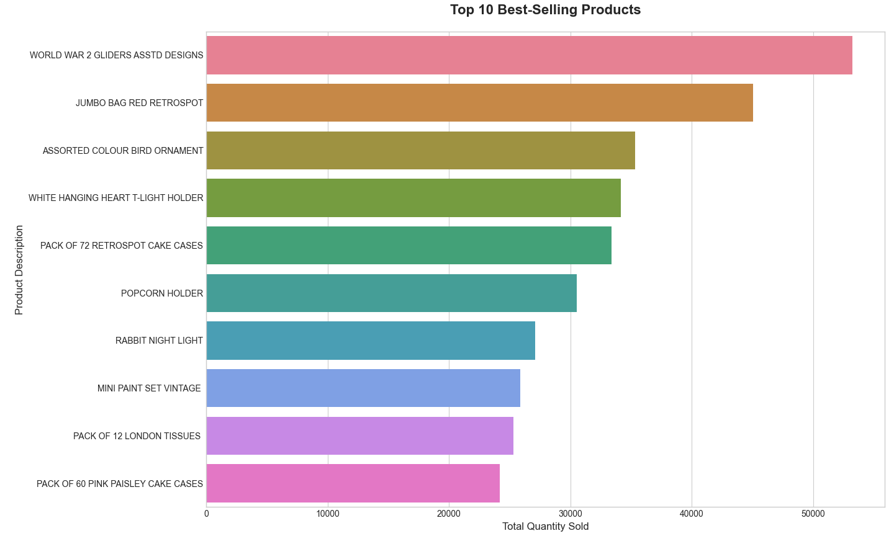
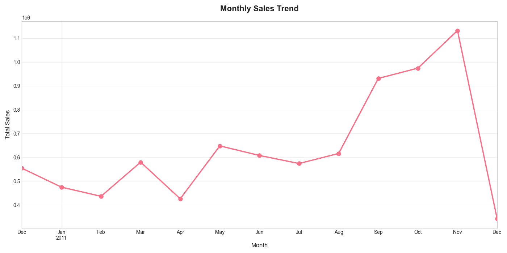
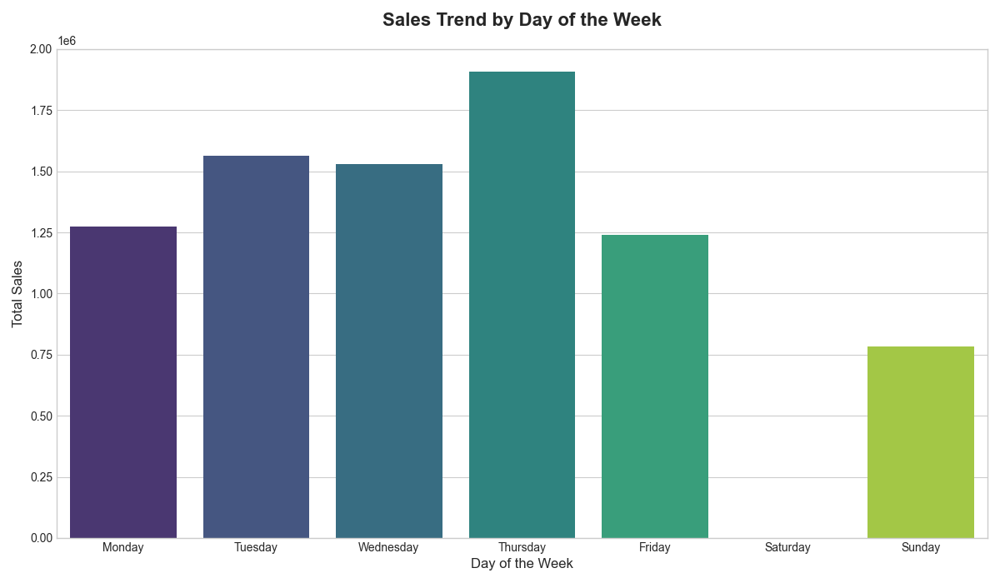
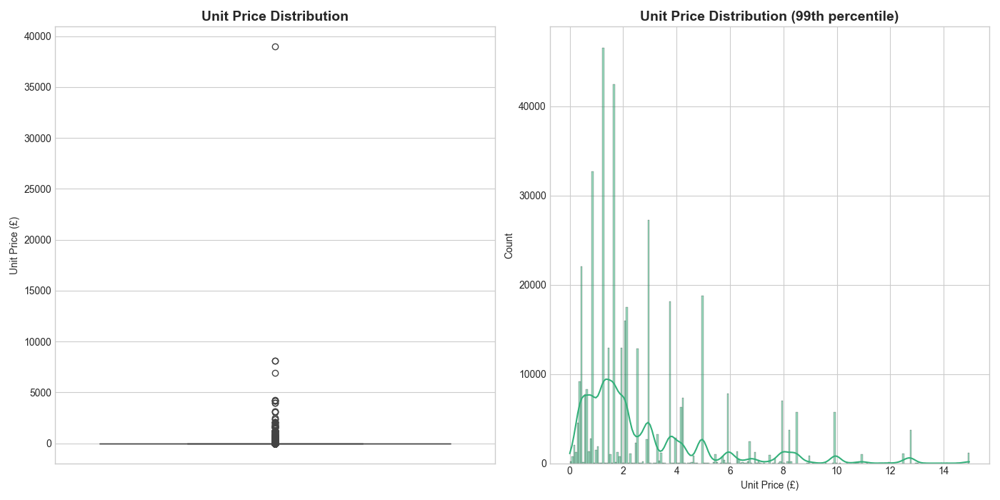

# Online Retail Data Analysis

## Project Overview
This project analyzes an online retail dataset to uncover sales patterns, identify top-selling products and countries, and explore customer purchasing behavior.

## Visualizations

### Top Countries by Sales

### Best-Selling Products

### Monthly Sales Trend

### Sales by Day of Week

### Unit Price Distribution

## Dataset
The dataset used is the "Online Retail" dataset containing transactions from an online store.

## Analysis Includes:
- Data cleaning and preprocessing
- Top countries by sales volume
- Best-selling products analysis
- Monthly and daily sales trends
- Outlier detection in pricing
- Customer spending patterns

## Technologies Used
- Python
- Pandas
- NumPy
- Matplotlib
- Seaborn

## How to Run
1. Ensure you have Python installed
2. Install required packages: `pip install pandas numpy matplotlib seaborn openpyxl`
3. Place the OnlineRetail.xlsx file in the project directory
4. Run the analysis script: `python retail_analysis.py`
